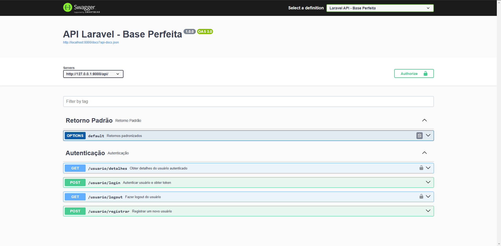

🎯 Descrição do Projeto:

Este projeto é uma base de Laravel que adota os princípios do SOLID, com o objetivo de oferecer um código altamente desacoplado, escalável e de fácil manutenção. A estrutura foi projetada para ser uma fundação sólida para qualquer aplicação web, garantindo eficiência e facilidade de expansão no futuro.

A arquitetura do projeto é composta por vários componentes chave que trabalham em conjunto para garantir flexibilidade, clareza e boas práticas de desenvolvimento. Vamos explorar a estrutura:

🔄 Arquitetura Base

1. DTO (Data Transfer Object):
   📦 Objetos que carregam dados entre os processos, sem lógica de negócio.
   Os DTOs são utilizados para transferir dados entre as camadas de aplicação (como Controllers e Services), mantendo o código mais organizado e fácil de entender.
2. Helpers:
   🛠️ Funções auxiliares que oferecem soluções reutilizáveis e simplificam tarefas comuns.
   Esses helpers oferecem funcionalidades reutilizáveis para operações como validação de dados, manipulação de strings e outras tarefas do dia-a-dia.
3. Controllers:
   🎮 Controladores que gerenciam as requisições e interagem com os serviços para retornar as respostas apropriadas.
   Os Controllers são responsáveis por receber e processar as requisições HTTP, delegando a lógica de negócio para os Services e retornando as respostas adequadas ao cliente.
4. Requests:
   📩 Validações de entrada para garantir que os dados recebidos nas requisições estão corretos.
   Esses Requests cuidam da validação e formatação dos dados que chegam para o sistema, antes de serem processados pelos Controllers.
5. Middlewares:
   🛡️ Camadas de proteção que podem interceptar as requisições, realizando verificações e alterações antes de elas chegarem ao Controller.
   Os Middlewares podem ser usados para autenticação, verificação de permissões e outras verificações necessárias antes que o pedido chegue ao Controller.
6. Models:
   📊 Representações das tabelas do banco de dados que interagem diretamente com os dados persistentes.
   Os Models são a ponte entre o banco de dados e a lógica de negócio, permitindo interagir com as tabelas de forma fluida.
7. Queries Manuais SQL:
   🔍 Consultas SQL personalizadas para operações complexas ou específicas que não podem ser facilmente feitas com Eloquent.
   Queries manuais são usadas para otimizar operações de leitura e escrita, especialmente em cenários mais complexos onde o Eloquent não é suficiente.
8. Repository Pattern:
   🏢 Padrão de design que facilita a abstração e o desacoplamento entre a lógica de acesso ao banco de dados e o resto da aplicação.
   O Repository fornece uma interface limpa para acessar os dados, promovendo a reutilização de código e permitindo fácil manutenção.
9. Services:
   🧑‍💻 Camada responsável pela lógica de negócios da aplicação.
   Os Services contêm a lógica de negócio que manipula dados e realiza operações antes de devolver a resposta ao Controller. Eles ajudam a manter os Controllers leves e focados apenas na manipulação de requisições.
10. Value Objects:
    🔑 Objetos imutáveis que representam conceitos ou entidades dentro do domínio do problema.
    Os Value Objects são usados para representar elementos de domínio com valor fixo, como moeda, email ou endereço, garantindo a consistência dos dados.

🛠️ Testes e Qualidade
🧪 Testes Unitários:
Os testes unitários são escritos para garantir que cada função do sistema esteja funcionando corretamente. Eles validam as operações de inserção de dados no banco de dados, aumentando a confiança no sistema.

📜 Documentação Swagger:
A documentação Swagger foi implementada para fornecer uma visão clara das rotas da API e facilitar o consumo da API por outras equipes. A documentação está disponível em: http://localhost:8000/api/documentation.

🌍 Visão Geral do Fluxo de Trabalho
Requisição HTTP chega ao Controller.
O Controller valida os dados com o Request e delega a lógica de negócios para o Service.
O Service processa os dados, utilizando os Repositories e Value Objects, e interage com o Model.
Se necessário, o Middleware pode verificar se a requisição é válida (exemplo: token de autenticação).
Após o processamento, o Controller retorna a resposta para o cliente.
Este projeto é mais do que uma simples aplicação Laravel – ele fornece uma base sólida para criar aplicações escaláveis e bem estruturadas. Com os componentes desacoplados, fácil manutenção e uso de padrões modernos de desenvolvimento, você tem à sua disposição todas as ferramentas para construir sistemas de alta qualidade.

📚 Documentação Completa
Toda a documentação da API está disponível para fácil consulta, tornando a integração e o entendimento do sistema mais ágil. Você pode acessá-la em:
http://localhost:8000/api/documentation.

